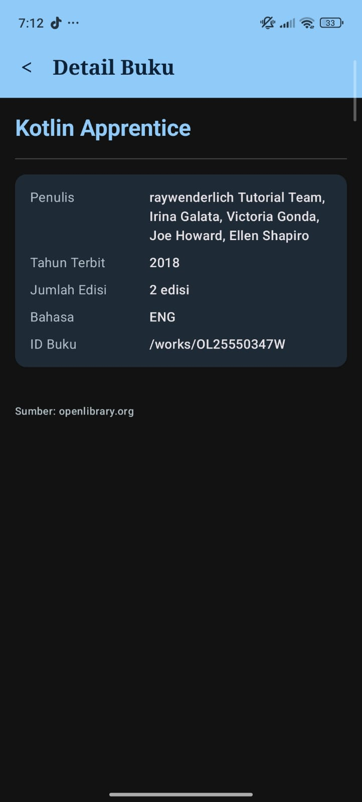

# 📚 Book Explorer – OpenLibrary Android App

Aplikasi mobile Android untuk mencari dan menjelajahi koleksi buku dari **OpenLibrary API** secara dinamis, tanpa memerlukan API Key.

---

## 📱 Screenshots

| Home Screen | Detail Screen |
|:-----------:|:-------------:|
|  |  |

---

## ✨ Fitur Aplikasi

- 🔍 **Real-time Search** – Cari buku berdasarkan kata kunci dengan debounce 500ms agar tidak spam request
- 📋 **Daftar Buku** – Tampilkan judul, penulis, dan tahun terbit pertama dalam LazyColumn yang efisien
- 📖 **Detail Buku** – Lihat informasi lengkap: judul, penulis, tahun, jumlah edisi, dan bahasa
- ⚡ **State-driven UI** – Loading spinner, pesan error, dan empty state yang responsif
- 🌙 **Dark Mode** – Mendukung tema terang dan gelap dengan custom color palette

---

## 🏗️ Arsitektur – MVVM

```
┌──────────────────────────────────────────────────┐
│                   UI Layer                       │
│  HomeScreen.kt ──── DetailScreen.kt             │
│         ↕                   ↑                   │
│  BookItem.kt (Reusable Composable)              │
└──────────────────┬───────────────────────────────┘
                   │ observes StateFlow
┌──────────────────▼───────────────────────────────┐
│              ViewModel Layer                     │
│  BookViewModel.kt                               │
│  - UiState<List<BookDoc>> (sealed class)        │
│  - searchQuery: StateFlow<String>               │
│  - selectedBook: StateFlow<BookDoc?>            │
└──────────────────┬───────────────────────────────┘
                   │ calls suspend fun
┌──────────────────▼───────────────────────────────┐
│             Repository Layer                     │
│  BookRepository.kt                              │
│  - searchBooks() → Result<List<BookDoc>>        │
└──────────────────┬───────────────────────────────┘
                   │ Retrofit call
┌──────────────────▼───────────────────────────────┐
│           Data / Remote Layer                    │
│  OpenLibraryApi.kt (Retrofit Interface)         │
│  RetrofitInstance.kt (Singleton)                │
│  BookDoc.kt + SearchResponse.kt (Data Class)    │
└──────────────────────────────────────────────────┘
```

### UiState (Sealed Class)
```kotlin
sealed class UiState<out T> {
    object Idle    : UiState<Nothing>()
    object Loading : UiState<Nothing>()
    data class Success<T>(val data: T) : UiState<T>()
    data class Error(val message: String) : UiState<Nothing>()
}
```

---

## 🌐 API – OpenLibrary

| Item | Keterangan |
|------|------------|
| **Base URL** | `https://openlibrary.org` |
| **Endpoint** | `/search.json?q={keyword}&limit=20` |
| **API Key** | Tidak diperlukan |
| **Format** | JSON |

### Contoh Response
```json
{
  "numFound": 500,
  "docs": [
    {
      "title": "Kotlin Programming",
      "author_name": ["Josh Skeen"],
      "first_publish_year": 2018,
      "edition_count": 3,
      "language": ["eng"],
      "key": "/works/OL123W"
    }
  ]
}
```

---

## 🛠️ Tech Stack

| Komponen | Library/Tool |
|----------|-------------|
| Bahasa | Kotlin |
| UI | Jetpack Compose + Material Design 3 |
| Networking | Retrofit 2.11.0 + Converter-Gson |
| Navigasi | Navigation Compose 2.9.0 |
| State | StateFlow + ViewModel Compose |
| Architecture | MVVM |
| Min SDK | 24 (Android 7.0) |
| Target SDK | 37 |

---

## 📁 Struktur Package

```
com.example.responsipemmobkotlin/
├── data/
│   ├── model/
│   │   ├── BookDoc.kt          # Data class buku (null-safe)
│   │   └── SearchResponse.kt   # Wrapper response API
│   ├── remote/
│   │   ├── OpenLibraryApi.kt   # Retrofit interface
│   │   └── RetrofitInstance.kt # Singleton Retrofit
│   └── repository/
│       └── BookRepository.kt   # Single source of truth
├── navigation/
│   └── AppNavGraph.kt          # NavHost 2 screen
├── ui/
│   ├── components/
│   │   └── BookItem.kt         # Reusable composable card
│   ├── screen/
│   │   ├── HomeScreen.kt       # Search + LazyColumn
│   │   └── DetailScreen.kt     # Detail buku
│   └── theme/
│       ├── Color.kt            # Custom navy/teal palette
│       ├── Theme.kt            # Light & Dark ColorScheme
│       └── Type.kt             # 4 typography overrides
├── viewmodel/
│   └── BookViewModel.kt        # UiState + StateFlow
└── MainActivity.kt
```

---

## 🚀 Cara Menjalankan

1. Clone repository ini
2. Buka dengan **Android Studio**
3. Sync Gradle (`File → Sync Project with Gradle Files`)
4. Jalankan di emulator atau perangkat fisik (pastikan ada koneksi internet)
5. Atau install APK debug dari folder `app/build/outputs/apk/debug/`

---

## 📝 Fitur Kotlin yang Digunakan

- ✅ **Data class** – `BookDoc`, `SearchResponse`
- ✅ **Null safety** – `?.`, `?:`, nullable types di semua field API
- ✅ **Lambda** – `onClick`, `onEach`, `filter`, `fold`
- ✅ **Extension property** – `displayAuthors`, `displayYear`, `displayEditions`, `displayLanguages`
- ✅ **Sealed class** – `UiState<T>`
- ✅ **Object (Singleton)** – `RetrofitInstance`, `AppRoutes`
- ✅ **Coroutines + Flow** – `StateFlow`, `debounce`, `distinctUntilChanged`
- ✅ **`by lazy`** – inisialisasi Retrofit yang deferred
# H1D024105_ResponsiPemmobKotlin
